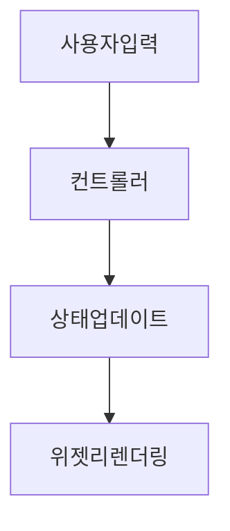

# 📘 BaseApp 개발자 코드 작성 규칙 (RULES.md)

이 문서는 Flutter 기반 **BaseApp 프로젝트**의 일관된 코드 스타일, 구조, 아키텍처를 정의합니다.  
**Claude, ChatGPT, Cursor** 등의 AI 도구들이 이 문서를 기반으로 코드를 생성하거나 수정할 수 있도록 구성되어 있습니다.

---

## 📌 기본 원칙 (General Principles)

- 모든 코드는 **영문**으로 작성합니다 (주석, 변수명, 함수명 포함)
- 모든 변수와 함수는 **타입을 명시**합니다
- `any` 사용을 지양하고 **명확한 타입 선언**을 사용합니다
- `const` 및 `final`을 적극적으로 사용하여 **불변성**을 유지합니다
- **매직 넘버**는 상수로 정의하고 의미 있는 이름을 사용합니다
- 하나의 함수 또는 클래스는 **하나의 책임(SRP)**만 가지도록 합니다
- **기능 단위로 커밋**하고, 커밋 메시지는 **한국어**로 작성합니다  
  → 예: `feat: 루틴 추가 기능 구현`, `fix: 알림 버그 수정`

---

## 🧱 아키텍처 구조 (Clean Architecture 기준)

/lib
├── core/             # 상수, 공통 유틸, 공용 인터페이스
├── data/             # 외부 데이터 소스 (API, DB, etc)
├── domain/           # 비즈니스 로직, 엔티티, 유스케이스
├── presentation/     # UI, 컨트롤러, 상태 관리
└── di/               # 의존성 주입 설정 (getIt)

### 권장 기술 스택
- **상태관리**: Riverpod  
- **상태모델**: freezed  
- **라우팅**: AutoRoute  
- **의존성 관리**: getIt  
- **로컬 저장소**: Hive  

---

## 📛 명명 규칙 (Naming Conventions)

| 대상         | 규칙        | 예시                           |
|--------------|-------------|--------------------------------|
| 클래스       | PascalCase  | `UserProfileController`        |
| 변수/함수    | camelCase   | `fetchUserProfile()`           |
| 파일/디렉토리| snake_case  | `user_profile_controller.dart` |
| 상수         | UPPER_CASE  | `MAX_LENGTH = 20`              |
| 불린값       | is/has/can+Verb | `isLoading`, `hasData`, `canEdit` |

---

## 🔧 함수 작성 규칙 (Functions)

- 함수는 **짧고 하나의 목적**만 가집니다 (20줄 이하 권장)
- 함수명은 **동사로 시작**하며 목적이 명확해야 합니다
- **Boolean 반환** → `isX()`, `hasX()`, `canX()`  
- **Void 반환** → `saveX()`, `executeX()`, `deleteX()`
- **Early Return** 원칙 사용 → 중첩 구조 줄이기
- `map`, `filter`, `forEach` 등 고차 함수 활용
- 다수의 인자를 전달할 땐 객체로 묶어서 전달 (RO-RO 원칙)

### ✅ RO-RO 예시

```dart
class FetchUserInput {
  final String userId;
  const FetchUserInput({required this.userId});
}

class UserResult {
  final User user;
  const UserResult({required this.user});
}
```

---

## 🧩 클래스 작성 규칙 (Classes)

- 클래스는 **단일 책임 원칙(SRP)**을 따라 작성
- 최대 **200줄**, 공개 메서드는 **10개 이하** 권장
- 상속보다 **컴포지션** 우선
- 먼저 **인터페이스 정의 후 구현**
- 가능한 `const` 생성자, `immutable` 모델 사용

---

## ⚠️ 예외 처리 (Exception Handling)

- 예상 가능한 오류는 **커스텀 예외 클래스로 처리**
- 예상치 못한 오류는 **전역 핸들러 처리**
- `try-catch` 내부에서는 반드시:
  - 문제를 해결하거나
  - 로그를 남기고 context 정보를 추가

---

## 🧪 테스트 작성 규칙 (Testing)

- 테스트는 **Arrange-Act-Assert** 패턴으로 구성
- 테스트 명과 변수 명은 **명확하고 목적이 드러나도록**
- 예: `inputUser`, `mockRepository`, `actualResult`, `expectedResult`
- 모든 **public 함수에는 단위 테스트 작성**
- 외부 의존성(Mock, Fake) 사용 권장 (Firebase 등 경량 외부는 예외)
- **위젯 테스트** → `widget_test.dart`
- **통합 테스트** → `integration_test/` 디렉토리 사용

---

## 🖼 UI 개발 규칙 (Flutter Specific)

- **위젯 트리는 얕게 유지**하고, **작은 단위 위젯으로 분리**
- 가능한 `const` 생성자를 사용해 **성능 최적화**
- 색상, 폰트, 스타일은 **ThemeData** 또는 전역 클래스(`AppColors`)로 관리
- 번역은 `AppLocalizations` 사용
- 상태 변경은 **Controller → State → UI** 흐름을 따름

### 🔄 상태 흐름 구조



---

## 📁 예시 디렉토리 구조

/lib
├── core/
│   ├── constants/
│   ├── extensions/
│   └── utils/
├── data/
│   ├── datasources/
│   └── repositories/
├── domain/
│   ├── entities/
│   └── usecases/
├── presentation/
│   ├── controllers/
│   ├── screens/
│   └── states/
└── di/
    └── service_locator.dart

---

## 🔨 커밋 메시지 규칙 (Commit Rule)

- 한 기능 또는 단위 작업이 **완료될 때마다 커밋**
- 커밋 메시지는 **명확한 한글로 작성**
- Prefix 예시:
  - `feat:` 새로운 기능 추가
  - `fix:` 버그 수정
  - `refactor:` 리팩토링
  - `docs:` 문서 수정
  - `style:` 스타일, 포맷 수정
  - `test:` 테스트 코드 추가
  - `chore:` 기타 작업

예:
```bash
git commit -m "feat: 루틴 생성 기능 추가"
git commit -m "fix: 알림이 울리지 않는 버그 수정"
```

---

## 📎 부록

- 이 문서는 Claude, GPT, Cursor 등 **AI 도구와 호환**됩니다
- 프로젝트 외부 공개 시 `CONTRIBUTING.md`로 활용할 수 있습니다
- 문서 책임자: **gyhmac**

---

## 🔁 문서 업데이트

- 문서는 수시로 업데이트 가능합니다
- 변경 사항은 GitHub Pull Request로 관리하며 변경 이력을 남깁니다